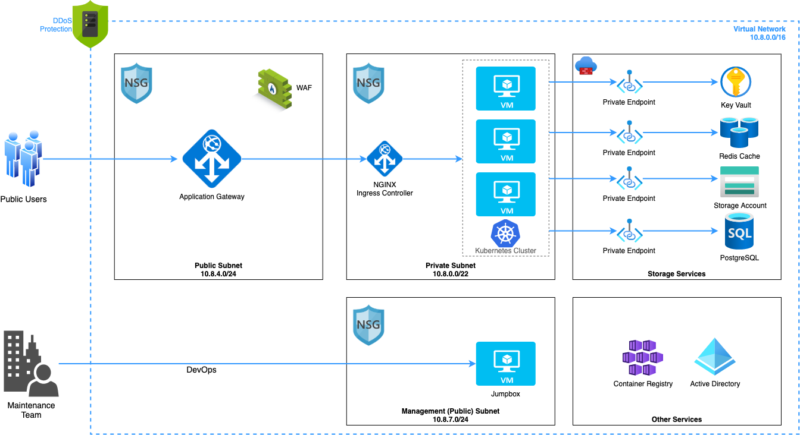

# Standard Production Ready Cloud Setup on Azure (with AKS) #
This repo is for standard 3-tier microservice based application platform setup on Azure using Azure CLI (IaC). IaC includes only Azure components and make it ready for any kubernetes based application to be deployed (application deployment is not in the scope).   

## How do I get set up? ##

> **Configuration**   
Update paramters/env-{env}.sh file for required azure resources and configuration.  
Note: Resource creation in Azure incur cost, review the configuration before running the script.

> **Usage**   
./run.sh [OPTIONS]

> **Options**  
-c, --command     Command for script [deploy | destroy]  
-e, --env         Environment for the script [staging | production]  
-l, --log         Print log to file  
-s, --strict      Exit script with null variables.  i.e 'set -o nounset'  
-d, --debug       Runs script in BASH debug mode (set -x)  
-h, --help        Display this help and exit  
--version         Output version information and exit  

> **Example**  
$./run.sh -c deploy -e staging -l  
$./run.sh -c destroy -e staging -l  